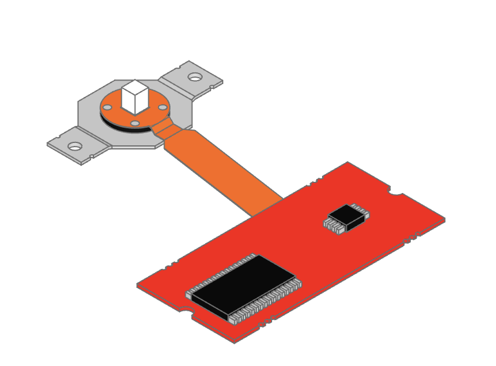

# 3D Model Generation

These are python scripts to generate various 3D models that can be used to visualize components in KiCad.

They are generated using [build123d](https://build123d.readthedocs.io/en/latest/index.html), a python CAD modeling library.

## Table Of Contents  <!-- omit from toc -->

- [Model Descriptions](#model-descriptions)
    - [Trackpoint Models](#trackpoint-models)
    - [TrackPoint Caps](#trackpoint-caps)
- [Script Setup Instructions](#script-setup-instructions)
    - [Setup Build123d](#setup-build123d)
    - [Setup VSCode OCP CAD Viewer](#setup-vscode-ocp-cad-viewer)

## Model Descriptions

### Trackpoint Models



Currently, only a model for the red IBM TrackPoint that is found in the Lenovo T460S is available.

You can adjust the height at which the PCB is rendered. The code dynamically adjusts the spacing between the sensor and pcb modules as you increase or decrease the height of the pcb.

By default the model aligns the sensor and pcb at the bottom, but when you are simulating placement in KiCad, you generally want to align the top of the PCB. For that purpose you can use the `build_tp_aligned_to_platform()` and `build_tp_aligned_to_screw_mount()` methods.

You can also pass them parameters that move the pcb or entire model "down" on the z-axis to simulate mounting of the TrackPoint directly to the PCB, above the hotswap sockets, etc.

The biggest value of using these scripts to generate your custom models is that you can generate the right vertical offsets for your exact setup.

### TrackPoint Caps


## Script Setup Instructions

### Setup Build123d

You will need to [install build123d by following these instructions](https://build123d.readthedocs.io/en/latest/installation.html).

If you are using an Apple Sillicon mac, you will run into some incompatibility issues. The best way to [work around them is described here](https://github.com/gumyr/build123d/issues/646).

A best practice is to create virtual python environments for different purposes and projects. I recommend using [pyenv](https://github.com/pyenv/pyenv) and [pyenv-virtualenv](https://github.com/pyenv/pyenv-virtualenv) for that purpose.

Here is an example setup...

```bash
# Install python
pyenv install 3.11

# Create a new environment
pyenv virtualenv 3.11 build123d

# Activate the environment
pyenv activate build123d

# Make it the default environment for the current directory
# so that it activates whenever you cd into it.
pyenv local build123d

# Install requirements
pip install -r requirements.txt

# OR if using macOS with Apple Silicon (M1, M2, M3, ...)
pip install -r requirements-macos_arm64.txt

# But, you MUST use python 3.11, because the requirements are tied to it.
#
# Otherwise you will get an error like...
# `ERROR: cadquery_ocp-7.7.2-cp39-cp39-macosx_11_0_arm64.whl is not a supported
# wheel on this platform.`
#
# If you want to use another version, make sure to install cadquery-ocp manually
# using the instructions here: https://github.com/gumyr/build123d/issues/646
#
# And then install the regular requirements from requirements.txt
pip install -r requirements.txt

# Test build123d
python3 -c 'from build123d import *;print(Solid.make_box(1,2,3).show_topology(limit_class="Face"))'

# If you see output like the one below, it means you have successfully installed
# all requirements
Solid        at 0x7f94f439f630, Center(0.5, 1.0, 1.5)
└── Shell    at 0x7f94f3ab58f0, Center(0.5, 1.0, 1.5)
    ├── Face at 0x7f94f4387870, Center(0.0, 1.0, 1.5)
    ├── Face at 0x7f94fdf50c70, Center(1.0, 1.0, 1.5)
    ├── Face at 0x7f94f5dc38f0, Center(0.5, 0.0, 1.5)
    ├── Face at 0x7f94f2f06c70, Center(0.5, 2.0, 1.5)
    ├── Face at 0x7f94f2f06e30, Center(0.5, 1.0, 0.0)
    └── Face at 0x7f94f2f06b70, Center(0.5, 1.0, 3.0)
```

At this point you will be able to run the scripts in this directory and get the step and stl files.

But if you want to make changes and preview them, then you should...

### Setup VSCode OCP CAD Viewer

If you want to make changes and see a preview, I recommend using VSCode and the excellent [OCP CAD Viewer extension](https://github.com/bernhard-42/vscode-ocp-cad-viewer).

- Install [VSCode](https://code.visualstudio.com)
- Install the [VSCode Python extension](https://marketplace.visualstudio.com/items?itemName=ms-python.python)
- Install [OCP CAD Viewer extension](https://github.com/bernhard-42/vscode-ocp-cad-viewer)
- Open this repo in VSCode
- Select the `build123d` environment
    - Press `command+shift+P`
    - Enter the command `Python: Select Interpreter`
    - Select the environment you created earlier
- Open the jupyter notebook `build123d.ipynb`
- Select the `build123d` kernel for the notebook
    - Click on the button in the upper right corner. It should show the currently selected kernel like "Python 3.11.9" or "xxx (Python 3.11.9)
    - Press `Select Another Kernel -> Python Environments`
    - Select the environment you created earlier (`build123d`)
- Start OCP Viewer
    - Press `command+shift+P`
    - Enter the command `OCP CAD Viewer: Open Viewer`
- Run the init cell
    - Hover your mouse over the first cell
    - On the left side a `Play Button (triangle)` should appear
    - Press it to run the code
- Generate a model
    - Press the play button at one of the cells with code that generates a model
    - The viewer should show the model
- For further instructions and help check out...
    - [The build123d documentation](https://build123d.readthedocs.io/en/latest/index.html)
    - [The OCP Viewer usage instructions](https://github.com/bernhard-42/vscode-ocp-cad-viewer)
    - And the c[adquery / build123d discord server](https://discord.com/invite/Bj9AQPsCfx)
