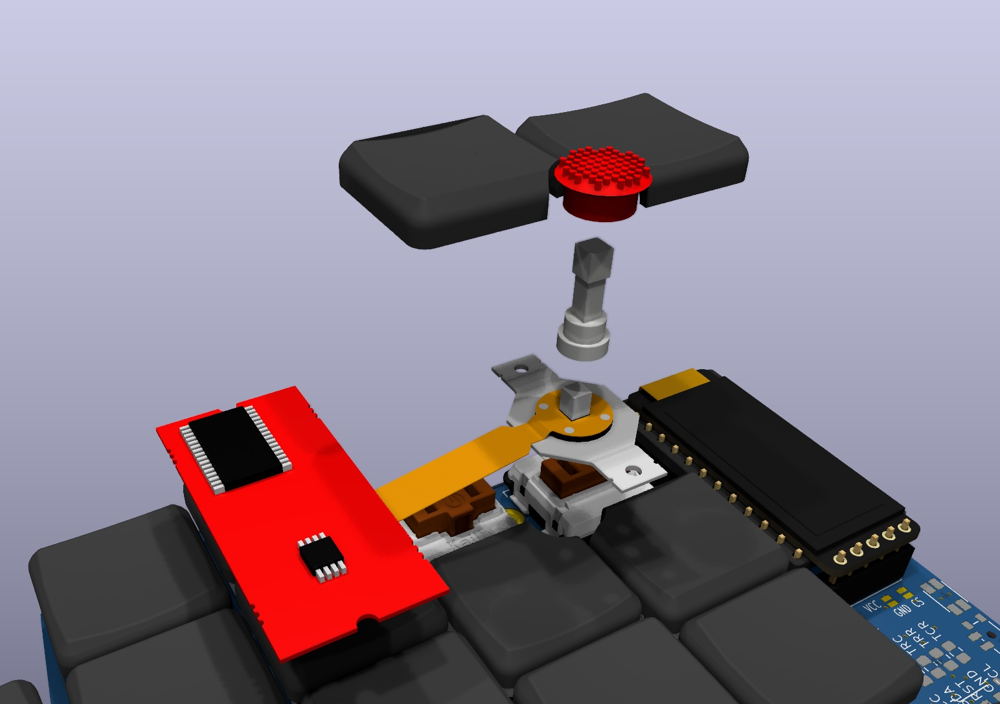

# Trackpoint 3D Models



## Table Of Contents  <!-- omit from toc -->

- [Trackpoint](#trackpoint)
- [Extension](#extension)
- [Cap](#cap)
- [Keycaps](#keycaps)
  - [Create custom keycaps for different staggers](#create-custom-keycaps-for-different-staggers)
- [How to convert from STL to Step](#how-to-convert-from-stl-to-step)

## Trackpoint

This model is generated using the python library build123d and you can find the code in [../../3d_model_src](../../3d_model_src/).

There are a few different versions of the model

The main difference is in how the TP PCB and sensor are aligned. In models with `screw_mount` in the file name, the PCB is aligned with the metal screws.

But the round platform on top of the metal frame is a 0.6mm higher than the screws mount and 8mm wide. To mount the TP flush, you need an 8mm hole, which won't be possible on many PCBs.

To simulate that type of mounting, you can use the models with `platofrm` in the file name. In those, the PCB top is aligned with the round platform.

On top of that the models have two parameters:
- `z_offset` is by how much the entire model is moved down on the z axis. So, the `screw_mount_z_offset_-2.0` places the screw mount part of the model just below choc hotswap socket height.
- `pcb` is by how much the pcb is moved down in addition to the alignment. So `platform_z_offset_+0.0_pcb_offset_-2.0` is places the TP with the platform right below the keyboard PCB and moves the TP PCB just below the choc hotswap socket height.

All of these are parameterized. So, you can use the python code to generate your own variations.

## Extension

The extension models are generated using [my TP extension scripts](https://github.com/infused-kim/kb_trackpoint_extension).

The important thing is that, on choc boards, the switches are very close together and you have to make sure the extension isn't too thick near the switches. But at the same time the extension needs to be thick enough to withstand the pressure of the movement.

So, I designed the extension to be thicker below the PCB than above it. The `md` parameter defines how far below the PCB the extension is meant to be mounted.

You can [use my scripts to generate your own extensions](https://github.com/infused-kim/kb_trackpoint_extension) that match your keyboard. Make sure to use the `FOR_KICAD=true` parameter when generating them. It will ensure the extension is positioned well in KiCad.

The scripts can only produce STL files, but KiCad requires step files. At the bottom you can find instructions on how to convert STL files into the STEP format.

## Cap

A TP cap. Not much to say about it ;)

## Keycaps

These keycaps were generated using [my keycap cutter scripts](https://github.com/infused-kim/kb_keycaps_trackpoint).

To use them, you have to create separate footprint config items for the 4 switches around the TrackPoint.

Since the TP hole is exactly between all keys and the MBK keycap is symmetrical, you only need two keycap models. You just have to rotate them correctly for each key.

Here is a simplified example config:

```yaml
[...]
pcbs:
  your_keeb:
    [...]
    footprints:
      [...]

      # Keys around trackpoint mount
      choc_tp_index_top:
        what: infused-kim/choc
        where: matrix_index_top
        params:
          keycap_3dmodel_filename: '${EG_INFUSED_KIM_3D_MODELS}/trackpoint/TP_Keycap_MBK_Black_stagger_2.375_small.step'
          keycap_3dmodel_xyz_rotation: [0, 0, 0]


      choc_tp_index_home:
        what: infused-kim/choc
        where: matrix_index_home
        params:
          keycap_3dmodel_filename: '${EG_INFUSED_KIM_3D_MODELS}/trackpoint/TP_Keycap_MBK_Black_stagger_2.375_large.step'
          keycap_3dmodel_xyz_rotation: [0, 0, 180]

      choc_tp_inner_top:
        what: infused-kim/choc
        where: matrix_inner_top
        params:
          keycap_3dmodel_filename: '${EG_INFUSED_KIM_3D_MODELS}/trackpoint/TP_Keycap_MBK_Black_stagger_2.375_large.step'
          keycap_3dmodel_xyz_rotation: [0, 0, 180]

      choc_tp_inner_home:
        what: infused-kim/choc
        where: matrix_inner_home
        params:
          keycap_3dmodel_filename: '${EG_INFUSED_KIM_3D_MODELS}/trackpoint/TP_Keycap_MBK_Black_stagger_2.375_small.step'
          keycap_3dmodel_xyz_rotation: [0, 0, 180]
```

### Create custom keycaps for different staggers

The keycaps included here are for the 2.375mm stagger that is used by the corne and many other keyboards.

If your keyboard uses a different stagger for the two inner rows, then you will need to create keycaps cut for it.

You can do it using [my TrackPoint keycap cutter script](https://github.com/infused-kim/kb_keycaps_trackpoint).

It supports MBK and Chicago Stenographer keycaps. And you can easily add support for other keycaps.

But it uses OpenSCAD, which can't generate STEP files, which KiCad needs.

Below you can find instructions on how to convert STL to step.

## How to convert from STL to Step

You can use the free version of Fusion360 to convert STL into STEP files.

* Create a new file
  * Do not open the STL directly. That will mess up the units
* Select the `Mesh` tab on the top toolbar
* Select `Insert Mesh` (first icon)
  * Select the STL file and click `Open`
  * This will load the model and show a `Insert Mesh` window
  * Make sure the `Unit Type` is set to `Millimeter`
  * Press the `OK` button
* Select `Modify -> Convert Mash`
    * Click on the keycap
    * Set the settings:
        * Operation: `Parametric`
        * Method: `Faceted` (First Icon)
    * Press `OK`
* Change the color of the keycap
    * Select `Modify -> Appearance`
    * In the list find `Plastic -> Nylon 12 (with Formlabs Fuse 1 3D Printer)` (to get the same black color as the other keycaps)
    * Drag it on top of the keycap
* Export it using `File -> Export` (select step as the format)
