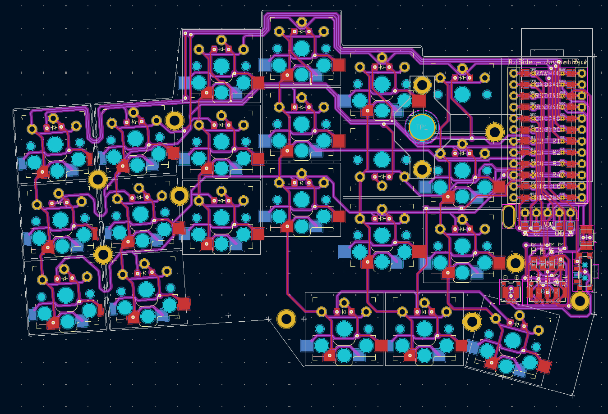
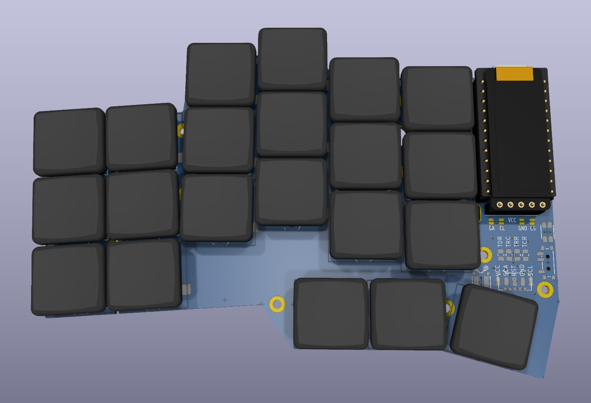
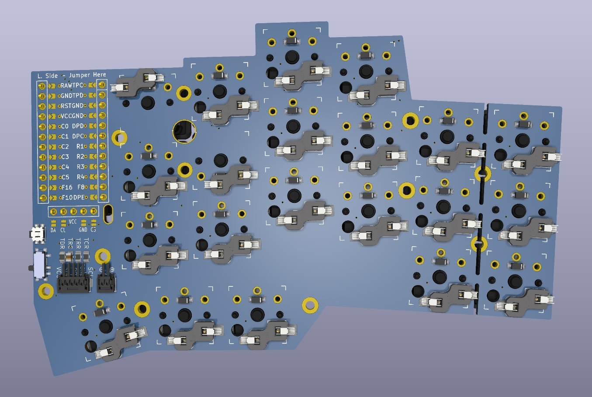

# @infused-kim's ergogen PCB footprints

> [!NOTE]
>
> These footprints have been tested on a reversible board and work, but they are not being actively developed and improved further except when I need them for my own keyboard.
>
> You may want to check out [ceoloide's footprint library](https://github.com/ceoloide/ergogen-footprints), which contains many of my footprints and is more actively developed.
>
> One feature this library has, that isn't yet in ceoloide's, is that it contains 3D models for almost all footprints.

- [Photos](#photos)
- [Installation](#installation)
    - [How to add the footprints as a git submodule](#how-to-add-the-footprints-as-a-git-submodule)
    - [How to use them in your ergogen config](#how-to-use-them-in-your-ergogen-config)
    - [How to update the submodule](#how-to-update-the-submodule)
    - [How to clone your ergogen repo](#how-to-clone-your-ergogen-repo)
- [How to use the 3D models](#how-to-use-the-3d-models)
    - [Tell KiCad where to find the models](#tell-kicad-where-to-find-the-models)
    - [Customize models](#customize-models)
- [How to design or modify ergogen footprints](#how-to-design-or-modify-ergogen-footprints)
- [License](#license)

## Photos

Here is an example keyboard using these footprints in KiCad's PCB editor...



And here is the automated 3D preview generated using the 3D models included in this library:





## Installation

### How to add the footprints as a git submodule

Add the footprint library as a git submodule to your project...

```bash
git submodule add git@github.com:infused-kim/kb_ergogen_fp.git ergogen/footprints/infused-kim/
```

Make sure to adjust the path to a subfolder in your ergogen folder (`ergogen/footprints/infused-kim/` in the example above.)

### How to use them in your ergogen config

You can then use the footprints in your ergogen config.yaml:

```yaml
[...]
pcbs:
    your_keyboard:
        footprints:
            # Controller
            promicro:
                what: infused-kim/nice_nano_pretty
                params:
                    traces: true
                    show_via_labels: false
[...]
```

### How to update the submodule

To update to a newer version...

```bash
# Pull updates inside the submodule repo
cd ergogen/footprints/infused-kim/
git checkout main
git pull

# Update the submodule in the parent repo
cd ..
git add .
git commit -m "Updated infused-kim footprint submodule"
```

### How to clone your ergogen repo

Users who clone your ergogen repo, must also update the submodule. So you should instruct them to either clone with the `--recursive` mode...

```bash
git clone --recursive git@github.com:your-user/your-keyboard.git
```

Or do init and update the submodules in a repo that was already cloned repo without the `--recursive` argument...

```bash
git clone git@github.com:your-user/your-keyboard.git
cd your-keyboard
git submodule init && git submodule update
```

Git will load exactly the same version of the footprints that you used. So you don't need to worry about accidental updates to incompatible future versions.


## How to use the 3D models

### Tell KiCad where to find the models

- Open Kicad's PCB editor
- In the menu bar select `Preferences -> Configure Paths`
- Add `EG_INFUSED_KIM_3D_MODELS` with the path to this directory

After that select `View -> 3D Viewer` and the models should show up.

### Customize models

You can also customize the positioning of the models or use different models through ergogen footprint parameters.

The footprint code includes rotational and offset transforms to place the models correctly on both the front and back side.

By default the model is placed on the same side as the footprint. But each footprint also has a `xxx_3dmodel_side` parameter that you can use to override the side without needing to apply custom transforms.

Another important note is that one footprint can contain multiple 3d models that you can toggle off by overriding the `xxx_3dmodel_filename` parameter with `''`.

Check the footprint JS files to see what models and options are available.

And then configure them, like...

```yaml
      choc_hotswap:
        what: infused-kim/choc
        where: [key]
        params:
          reverse: true
          from: "{{column_net}}"
          to: "{{colrow}}"

          # Here you are configuring the 3d model for the keycap
          keycap_3dmodel_filename: '${EG_INFUSED_KIM_3D_MODELS}/Choc_V1_Keycap_MBK_Red_1u.step'
          keycap_3dmodel_xyz_rotation: [90, 0, 0]

          # And here for the switch
          switch_3dmodel_xyz_rotation: [0, 90, 0]
```

You can also change these settings directly in KiCad where you can see how they affect the 3D model.

Once you find the right settings, you can transfer them into your ergogen config to make them permanent.

- Open the KiCad PCB editor
- Click on the footprint
- Press `e`
- Select the `3D Models` tab
- Adjust the values
- Once you are happy, add the same values to your ergogen config

## How to design or modify ergogen footprints

I wrote a [guide on how to convert KiCad footprints to ergogen that you can find here](https://www.notion.so/nilnil/Convert-Kicad-Footprint-to-Ergogen-8340ce87ad554c69af4e3f92bc9a0898?pvs=4).

If you want to modify any of the footprints here, you can find many of the original KiCad v5 footprint files I used or created in the [./kicad_footprints/](./kicad_footprints/) directory.

## License

**TLDR:**

- Personal use with attribution
- Commercial use not allowed

This work is licensed under a
[Creative Commons Attribution-ShareAlike 4.0 International License][cc-by-sa].

[![CC BY-SA 4.0][cc-by-sa-image]][cc-by-sa]

[cc-by-sa]: http://creativecommons.org/licenses/by-sa/4.0/
[cc-by-sa-image]: https://licensebuttons.net/l/by-sa/4.0/88x31.png
[cc-by-sa-shield]: https://img.shields.io/badge/License-CC%20BY--SA%204.0-lightgrey.svg
